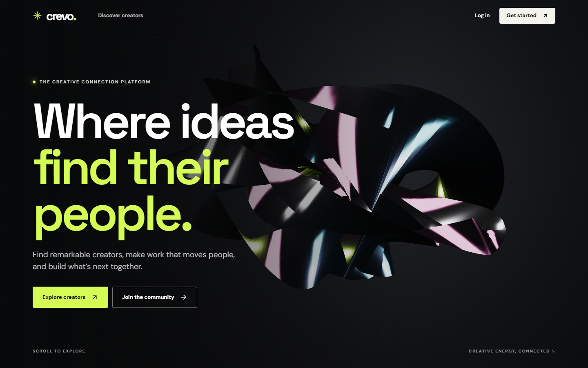

# Crevo

A React and FastAPI MVP for AI creator discovery and brand collaboration. The landing page uses React Three Fiber for an animated chrome ribbon. The app includes creator profiles, AI work portfolios with tools and workflows, structured briefs, applications, explainable matching, and project messages. Brands can close briefs, decline or accept applications, and mark projects complete.



## Run locally

Requires Node.js 20+ and Python 3.11+.

In one terminal:

```powershell
cd backend
python -m venv .venv
.\.venv\Scripts\Activate.ps1
pip install -r requirements.txt
Copy-Item .env.example .env
uvicorn main:app --reload
```

In a second terminal, from the project root:

```powershell
Copy-Item .env.example .env
npm install
npm run dev
```

Open `http://localhost:5173`. The API is at `http://localhost:8000`, with interactive API docs at `/docs`. Local mode creates `backend/crevo.db` and six sample creator profiles on first launch. Create one brand account and one creator account to try the full workflow.

Demo path: create a creator account → complete the profile → add an AI work sample with tools and usage terms → create a brand account → publish a structured brief → review ranked matches → return as the creator and apply → accept the application as the brand → exchange project messages → mark the project complete.

## Supabase mode

1. Create a Supabase project and run [`backend/schema.sql`](backend/schema.sql) in its SQL editor.
2. Copy `backend/.env.example` to `backend/.env` and set `SUPABASE_URL`, `SUPABASE_PUBLISHABLE_KEY`, and `SUPABASE_SECRET_KEY`. Legacy anon and service-role variable names remain supported for existing projects.
3. Restart FastAPI. `/api/health` will report `database: supabase`.
4. Add creator accounts or data in Supabase. The local sample creators are intentionally not copied into your production database.
5. In Supabase Auth URL configuration, set your app URL as the site URL. If email confirmation is enabled, users must confirm their email before logging in.

The secret key stays in the backend only. All data mutations and reads go through FastAPI, which checks the user's role and ownership. The SQL enables RLS, revokes direct table access from browser roles, and explicitly grants the service role Data API access. Profile photo uploads use the public `portfolios` bucket created by the schema. Local mode has no storage substitute and displays an explicit upload error.

## AI behavior

Set `OPENAI_API_KEY` in `backend/.env` to enable real portfolio introduction generation, AI assisted brief drafting, and AI assisted match assessment. `OPENAI_MODEL` defaults to `gpt-4.1-mini` and can be changed. These features use the OpenAI Responses API. Match ranking gives 70% weight to transparent category, skill, platform, budget, and location rules and 30% to an AI assessment of the top eight candidates. If the AI service is unavailable, the rules ranking remains available. Without an API key, portfolio introductions are labeled template drafts, brief drafting returns an explicit configuration error, and match ranking is labeled weighted rules. No simulated AI response is presented as AI generated.

Creators can add work samples with a media URL, AI tools/models, production workflow, output format, and commercial-use terms. Those claims are marked **creator reported**, since this MVP has no independent verification service. Briefs include content type, style, format/aspect ratio and commercial-use requirements. Media URLs must be publicly accessible; Supabase Storage currently handles profile photos only.

## Verify

```powershell
npm run build
cd backend
pytest -q
```

The test covers account creation, profile editing, AI work portfolio metadata, structured brief publishing, ranked discovery, applying, accepting, messaging, duplicate application handling, and role access. It uses an isolated local database.

**Validation status:** `npm run build` passes and `python -m pytest -q` passes (1 end-to-end test). The running frontend returns HTTP 200, and `/api/health` reports `database: supabase` when configured. A temporary live Supabase smoke test passed Auth login, profile updates, portfolio items, avatar Storage upload, briefs, matching, applications, messaging, and project completion; all temporary records and files were removed. Browser checks passed at desktop and mobile sizes, including navigation to discovery and signup. `npm audit --omit=dev` reports zero production dependency vulnerabilities. The 3D hero loads separately, though its chunk still produces a build size warning. Email confirmation remains to be tested with a real inbox.

## Current scope

- Messages update after sending or page refresh; live subscriptions are not implemented.
- A project begins when a brand accepts an application. Milestones, payments, and file sharing are not yet part of this MVP.
- Local auth is for development. Use Supabase Auth and a strong server secret for shared deployments.
- The landing page's 3D hero needs WebGL. A static dark background remains when WebGL is unavailable.


## Public deployment

The repository includes a single-service Render Docker deployment. The container builds the Vite frontend and serves it with FastAPI from one public URL. Supabase remains the persistent database, Auth service, and avatar store; Render's free container filesystem is not used for saved data.

1. Push this folder as a public GitHub repository. Local `.env` files, build output, dependencies, and the earlier `marketplace-prototype/` are excluded from Git and Docker.
2. Import `render.yaml` as a Render Blueprint. Choose the Free web service plan. Enter `SUPABASE_URL`, `SUPABASE_PUBLISHABLE_KEY`, and `SUPABASE_SECRET_KEY` as private environment values. Enter `OPENAI_API_KEY` to enable actual AI portfolio introductions, brief drafting, and AI match assessment. Never commit or paste these values into a public page.
3. Once Render reports the service is live, set the Supabase Auth Site URL to the public `https://...onrender.com` URL. Add `http://localhost:5173/**` as an additional redirect URL if you still use local development.
4. Check `/api/health` for `database: supabase` and `ai_enabled: true` (when the AI key is set). Complete a real creator and brand signup, confirm emails, and walk through a brief, application, acceptance, and project message.

Render's Free web service spins down after idle time, so the first visit may take about a minute. Supabase's default email service is intended for testing; configure SMTP before broad public use.
